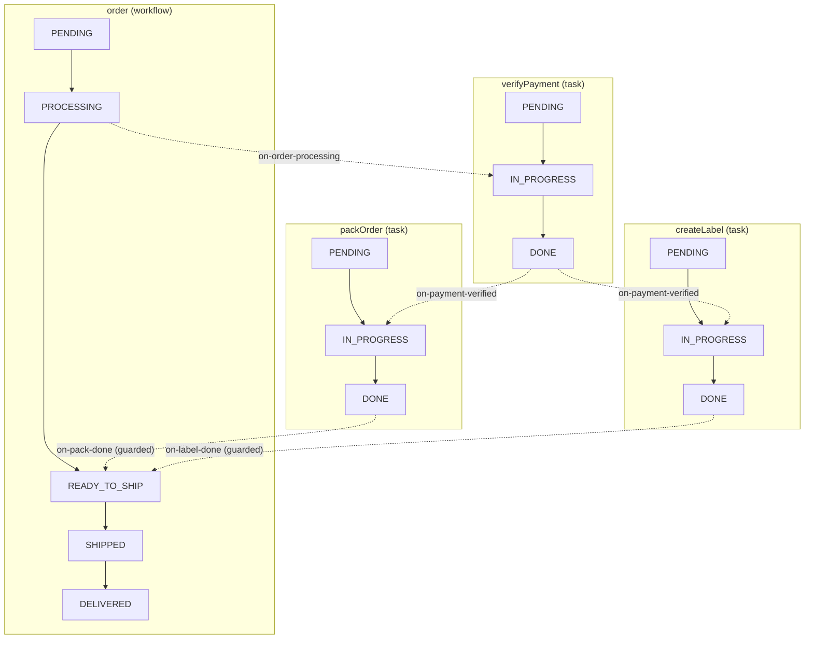

# Order Fulfillment Workflow Diagram

This document visualizes the Order Fulfillment demo workflow.

## ASCII Diagram

```
                            ORDER FULFILLMENT WORKFLOW
    ═══════════════════════════════════════════════════════════════════════

    ┌─────────────────────────────────────────────────────────────────────┐
    │                              order                                  │
    │         PENDING ──→ PROCESSING ──→ READY_TO_SHIP ──→ SHIPPED ──→ DELIVERED
    └─────────────────────────────────────────────────────────────────────┘
                  │                          ▲
                  │                          │
                  │  on-order-processing     │  on-pack-done / on-label-done
                  │  (order → PROCESSING)    │  Guard: ALL_OF
                  ▼                          │    - packOrder = DONE
    ┌───────────────────────────────────┐    │    - createLabel = DONE
    │    verifyPayment                  │    │
    │  PENDING ──→ IN_PROGRESS ──→ DONE │    │
    └───────────────────────────────────┘    │
                  │                          │
                  │                          │
                  │  on-payment-verified     │
                  │  (verifyPayment → DONE)  │
                  │                          │
          ┌───────┴───────┐                  │
          │               │                  │
          ▼               ▼                  │
    ┌───────────┐   ┌───────────┐            │
    │ packOrder │   │createLabel│            │
    │  PENDING  │   │  PENDING  │            │
    │     │     │   │     │     │            │
    │     ▼     │   │     ▼     │            │
    │IN_PROGRESS│   │IN_PROGRESS│            │
    │     │     │   │     │     │            │
    │     ▼     │   │     ▼     │            │
    │   DONE ───┼───┼── DONE ───┼────────────┘
    └───────────┘   └───────────┘
```

## Mermaid Diagram

### State Flow



## Demo Output

Running `npm run demo` produces:

```
=== Order Fulfillment Demo ===

--- 1. Start processing ---
order: PENDING → PROCESSING
verifyPayment: PENDING → IN_PROGRESS (via on-order-processing)

--- 2. Payment verified ---
verifyPayment: IN_PROGRESS → DONE
packOrder: PENDING → IN_PROGRESS (via on-payment-verified)
createLabel: PENDING → IN_PROGRESS (via on-payment-verified)

--- 3. Pack order complete ---
packOrder: IN_PROGRESS → DONE

--- 4. Label created (triggers merge) ---
createLabel: IN_PROGRESS → DONE
order: PROCESSING → READY_TO_SHIP (via on-label-done)

--- 5. Ship order ---
order: READY_TO_SHIP → SHIPPED

--- 6. Deliver order ---
order: SHIPPED → DELIVERED
```
